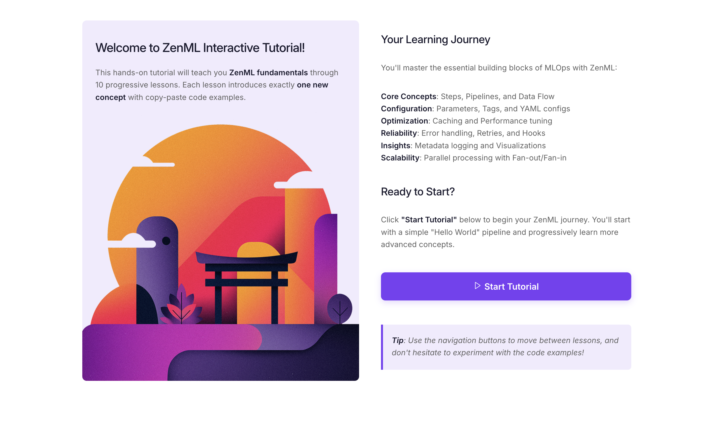
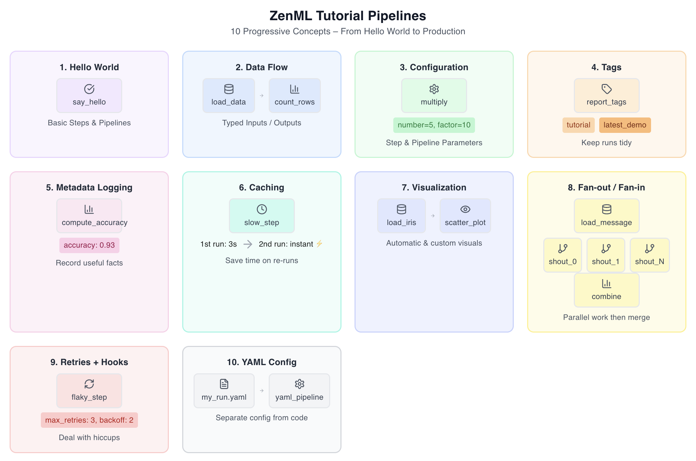
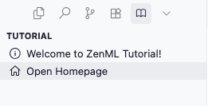
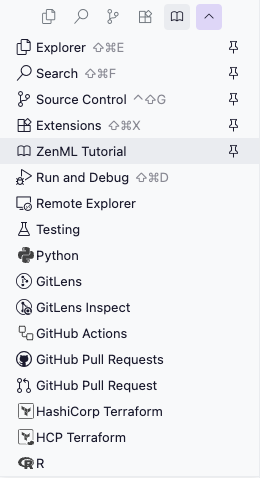
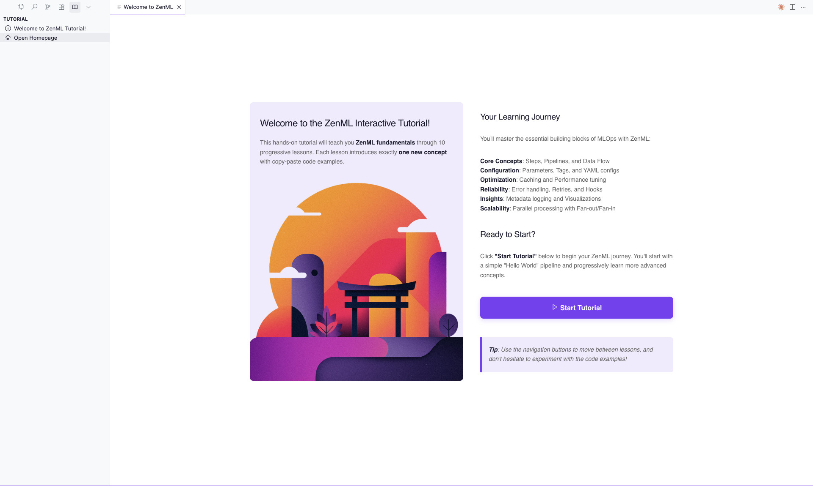

# Welcome to the ZenML Interactive Tutorial Extension 👋

This VS Code extension provides an interactive, hands-on learning experience for ZenML - the open-source MLOps framework. Master ZenML fundamentals through 10 guided pipeline examples with step-by-step tutorials and one-click execution!

<div style="display: flex; justify-content: center;">
  
</div>


## ✨ What You'll Learn

- **Pipeline Fundamentals** - Create your first ZenML pipeline
- **Data Flow** - Pass data between pipeline steps
- **Parameters** - Make pipelines flexible with parameters
- **Organization** - Tag and organize your pipeline runs
- **Tracking** - Log metadata to record useful facts about runs
- **Visualizations** - Create automatic & custom charts
- **Performance** - Use caching and parallel processing
- **Reliability** - Handle errors with retries and hooks
- **Configuration** - Use YAML to separate configuration from code

**10 Progressive Tutorials** that build from basic concepts to advanced ZenML patterns.

<div style="display: grid; grid-template-columns: 1fr 1fr; gap: 20px;">
  
</div>

## 🚀 Get Started

### GitHub Codespaces (Recommended)

The fastest way to get started - no local setup required.

1. Click **Code ▶ Codespaces ▶ Create codespace on develop**
2. Wait ~2 min for setup (container, dependencies, extension)
3. The extension will launch automatically

### Local Setup with Extension from Marketplace

**Prerequisites:**
- Python 3.8 or higher
- VS Code

**Steps:**

1. **Set up Python virtual environment:**
   ```bash
   python -m venv zenml-tutorial-env
   source zenml-tutorial-env/bin/activate  # On Windows: zenml-tutorial-env\Scripts\activate
   ```

2. **Install ZenML:**
   ```bash
   pip install zenml
   ```

4. **Initialize ZenML:**
   ```bash
   zenml init
   ```

5. **Start the ZenML server locally:**
   ```bash
   zenml login --local
   ```

6. **Install the extension:**
   - Install from the [Marketplace](https://marketplace.visualstudio.com/items?itemName=zenml-io.zenml-tutorial) or search for "ZenML Tutorial" in the Extensions Marketplace

7. **Launch the tutorial:**
   - Open VS Code and the extension will launch automatically

### 💻 Alternative: Local Setup with Dev Containers

**Requirements:**

- [Docker Desktop](https://www.docker.com/products/docker-desktop)
- [VS Code](https://code.visualstudio.com/)
- [Dev Containers Extension](https://marketplace.visualstudio.com/items?itemName=ms-vscode-remote.remote-containers)

**Steps:**

1. Clone this repo & open in VS Code
2. Click **Reopen in Container** when prompted
3. Extension starts automatically

## 🎓 Tutorial Structure

| Tutorial | Topic           | Skills                   |
| -------- | --------------- | ------------------------ |
| 1        | Hello World     | Basic pipeline creation  |
| 2        | Step I/O        | Data flow between steps  |
| 3        | Parameters      | Pipeline configuration   |
| 4        | Tagging         | Run organization         |
| 5        | Metadata        | Logging and tracking     |
| 6        | Caching         | Performance optimization |
| 7        | Visualizations  | Charts and plots         |
| 8        | Fan-out/Fan-in  | Parallel processing      |
| 9        | Retries & Hooks | Error handling           |
| 10       | YAML Config     | Configuration management |

## 🎮 How to Use

- **Run** pipelines via the “Run Pipeline” button
- **Navigate** with Previous/Next buttons
- **Inspect** output in the terminal and Dashboard link
- **Experiment** by editing any example code

## ⚙️ Extension Configuration

### Auto-Open Tutorial

The tutorial homepage opens automatically when you start VS Code in the following scenarios:
- **On first install** (always opens the first time you install the extension)
- **In GitHub Codespaces** (when `CODESPACES=true`)
- **When tutorial is enabled** (when `ZENML_ENABLE_TUTORIAL=true`)
- **When user setting is enabled** (see configuration options below)

You can control the user preference behavior:

#### 🔧 Quick Disable
When the welcome message appears, click **"Don't Show Again"** to disable auto-opening.

#### 🔧 Settings UI
1. Open VS Code Settings (`Ctrl+,` or `Cmd+,`)
2. Search for "zenml"
3. Toggle **"Auto Open Tutorial"** on/off

#### 🔧 Settings JSON
Add to your VS Code settings to enable auto-open (disabled by default):
```json
{
  "zenml.autoOpenTutorial": true
}
```

**Note**: You can always access the tutorial manually via the ZenML sidebar (book icon) or Command Palette (`Ctrl+Shift+P` → "ZenML: Open ZenML Tutorial Homepage").

#### 📖 Manual Tutorial Access

If the tutorial doesn't open automatically, you can easily access it manually:

**Method 1: Using the ZenML Tutorial Sidebar**
1. Look for the ZenML Tutorial icon (📖) in the Activity Bar (left side of VS Code)
2. Click on it to open the tutorial panel
3. Click "Open Homepage" to start the tutorial



**Method 2: Using the Main Sidebar**
1. Open the main VS Code sidebar (Explorer view)
2. Scroll down to find "ZenML Tutorial" in the extensions list
3. Click on it to access the tutorial



**Method 3: Using Command Palette**
1. Press `Ctrl+Shift+P` (or `Cmd+Shift+P` on Mac)
2. Type "ZenML: Open ZenML Tutorial Homepage"
3. Press Enter

Once opened, you'll see the welcome screen:



### Dashboard URL

Configure the ZenML dashboard URL for pipeline run links:
```json
{
  "zenml.dashboardUrl": "http://localhost:8237"
}
```

## 🛟 Getting Help

- **📖 ZenML Docs**: [docs.zenml.io](https://docs.zenml.io)
- **💬 Community**: [ZenML Slack](https://zenml.slack.com/ssb/redirect)
- **🐛 Issues**: [GitHub Issues](https://github.com/zenml-io/vscode-tutorial/issues)
